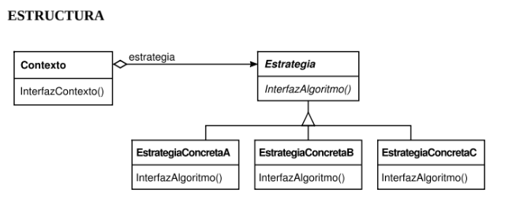
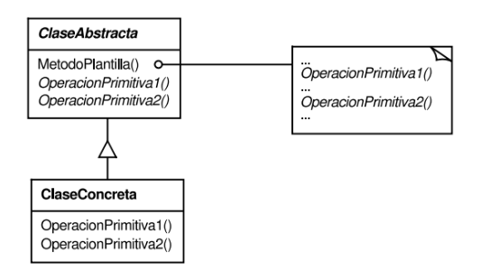

- En esta semana daremos un paso más en el diseño orientado a objetos profundizando en patrones de diseño, que son soluciones probadas y reutilizables para problemas comunes en el desarrollo de software. Estos patrones nos permiten escribir código más flexible, mantenible y fácil de extender

- Comenzaremos estudiando el Patrón Strategy, que nos ayuda a definir un conjunto de algoritmos intercambiables, permitiendo cambiar el comportamiento de un objeto en tiempo de ejecución sin modificar su estructura.
-

-

- Luego veremos el Patrón Template Method, que establece la estructura general de un algoritmo en una clase abstracta, dejando que las subclases definan algunos pasos específicos. Finalmente, exploraremos el Patrón Singleton, que asegura que una clase tenga una única instancia global, controlando su punto de acceso.

- 

-

- Durante la práctica, aplicaremos estos patrones a ejemplos concretos para comprender sus ventajas y cuándo utilizarlos. Además, continuaremos trabajando con repositorios y herramientas de desarrollo, reforzando las buenas prácticas en la escritura y organización del código.

<!-- - 
</img>
 -->

- Les recomendamos fuertemente leer la teoría del libro, es muy importante para entender en que situaciones es aplicable el patrón y la mejor forma de implementarlo <a href="/material#estructurales" target="_blank">**Utilidad**▼ Material> Patrones de Diseño</a>
